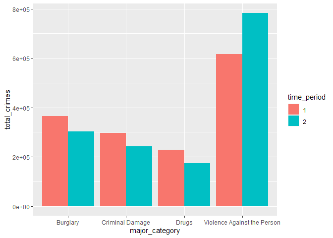
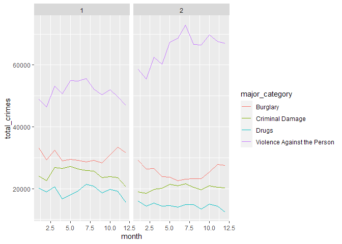
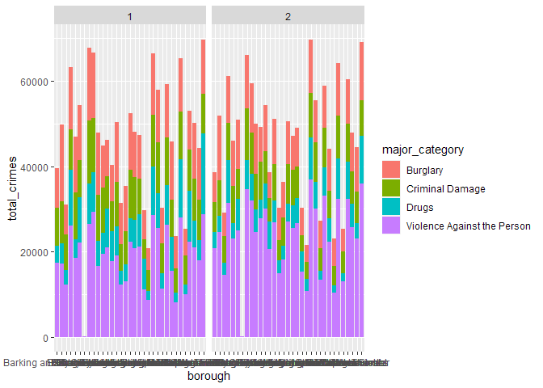

London Crime Visualization
================
Gray Underhill
2023-06-08

### London Crime Visualization Code

The goal of this visualization is to create three plots that each give
unique information about four types of crime in London from the period
of 2009 to 2016.

------------------------------------------------------------------------

### Loading Data

First, I set up the necessary packages for the visualization of my data.

``` r
library(tidyverse)
library(readxl)
library(scales)
```

I begin by loading the first sheet of my data for the total number of
crimes across the time periods.

``` r
crime_totals <- read_excel("london_crime_data_combined.xlsx", sheet=1)

# I change the "time_period" column from numeric to character so I can treat the time periods distinctly using ggplot.
crime_totals$time_period <- as.character(crime_totals$time_period)

print(crime_totals)
```

    ## # A tibble: 8 × 3
    ##   major_category              total_crimes time_period
    ##   <chr>                              <dbl> <chr>      
    ## 1 Violence Against the Person       615586 1          
    ## 2 Drugs                             228549 1          
    ## 3 Criminal Damage                   296534 1          
    ## 4 Burglary                          364152 1          
    ## 5 Violence Against the Person       782651 2          
    ## 6 Drugs                             173412 2          
    ## 7 Criminal Damage                   242532 2          
    ## 8 Burglary                          302049 2

------------------------------------------------------------------------

### Plot Number 1- Crime Totals

I create a rough plot first to see what the data attributes look like.

``` r
ggplot(data = crime_totals, aes(x=major_category, y=total_crimes, fill=time_period)) +
  geom_col(position=("dodge"))
```

<!-- -->

Because the data for this plot is looking correct, I add more parameters
to clean up and improve the plot.

``` r
ggplot(data = crime_totals, aes(x=major_category, y=total_crimes, fill=time_period)) +
  geom_col(position=("dodge")) +
  labs(title="Comparing Types of Crime in London, 2009-2016", x="Crime Category", y="Crimes Recorded") +
  scale_fill_manual(values = c("#6eceeb", "#ebde6e"),
                    labels = c("2009-2012", "2013-2016")) +
  scale_y_continuous(labels = unit_format(unit="K", scale=1e-3)) +
  guides(fill = guide_legend(title = NULL)) +
  theme(text = element_text(color = "#FDF5E6"), 
        axis.text = element_text(color = "#FDF5E6", face = "bold"),
        legend.text = element_text(face = "bold"),
        plot.title = element_text(face = "bold"),
        axis.title = element_text(face = "bold"),
        plot.background = element_rect(fill = "#666666"),
        legend.background = element_rect(fill = "#666666"),
        panel.background = element_rect(fill = "#666666"),
        panel.grid.major.x = element_blank(),
        panel.grid.minor.x = element_blank(),
        panel.grid.major.y = element_line(linewidth = 0.5, color = "#222222"),
        panel.grid.minor.y = element_line(linewidth = 0.5, color = "#222222"),
        panel.border = element_rect(fill = NA, linewidth = 1, color = "#222222"))
```

<!-- -->

``` r
ggsave("totals_plot.png", height = 1500, width = 2000, units = "px")
```

------------------------------------------------------------------------

### Plot Number 2- Crime by Month

Now I repeat this process with the second sheet from my data.

``` r
crime_monthly <- read_excel("london_crime_data_combined.xlsx", sheet=2)

crime_monthly$time_period <- as.character(crime_monthly$time_period)

head(crime_monthly)
```

    ## # A tibble: 6 × 4
    ##   major_category              month total_crimes time_period
    ##   <chr>                       <dbl>        <dbl> <chr>      
    ## 1 Violence Against the Person     1        48802 1          
    ## 2 Drugs                           1        20035 1          
    ## 3 Criminal Damage                 1        24029 1          
    ## 4 Burglary                        1        33017 1          
    ## 5 Violence Against the Person     2        46410 1          
    ## 6 Drugs                           2        18868 1

Here is the second rough plot to see what the data looks like initially.

``` r
ggplot(data = crime_monthly) +
  geom_line(aes(x = month, y = total_crimes, color = major_category)) +
  facet_wrap(~time_period)
```

<!-- -->

Everything looks fine so far, so I clean this plot up too.

``` r
# I create a separate label list to use as the facet titles
time_periods <- c(`1` = "Period: 2009-2012", `2` = "Period: 2013-2016")

ggplot(data = crime_monthly) +
  geom_line(aes(x = month, y = total_crimes, color = major_category), linewidth = 1.2) +
  facet_wrap(time_period ~ ., labeller = as_labeller(time_periods)) +
labs(title="Crimes Over the Course of the Year", x="Month of Year", y="Crimes Recorded") +
  scale_color_manual(values = c("#6eceeb", "#eb6eba", "#7feb6e", "#ebde6e"),
                     breaks = c("Violence Against the Person","Burglary","Criminal Damage","Drugs")) +
  scale_x_discrete(limits=c("1","2","3","4","5","6","7","8","9","10","11","12")) +
  scale_y_continuous(labels = unit_format(unit="K", scale=1e-3)) +
  guides(color = guide_legend(title = NULL)) +
  theme(text = element_text(color = "#FDF5E6"), 
        axis.text = element_text(color = "#FDF5E6", face = "bold"),
        legend.text = element_text(face = "bold"),
        plot.title = element_text(face = "bold"),
        axis.title = element_text(face = "bold"),
        plot.background = element_rect(fill = "#666666"),
        legend.background = element_rect(fill = "#666666"),
        panel.background = element_rect(fill = "#666666"),
        panel.grid.major.x = element_line(linewidth = 0.2, color = "#222222"),
        panel.grid.minor.x = element_line(linewidth = 0.2, color = "#222222"),
        panel.grid.major.y = element_line(linewidth = 0.2, color = "#222222"),
        panel.grid.minor.y = element_line(linewidth = 0.2, color = "#222222"),
        panel.border = element_rect(fill = NA, linewidth = 1, color = "#222222"),
        legend.key = element_rect(fill = "#666666"))
```

<!-- -->

``` r
ggsave("monthly_plot.png", height = 1500, width = 2500, units = "px")
```

------------------------------------------------------------------------

### Plot Number 3- Crime by Borough

The third and final sheet of my data concerns the crime numbers
separated by borough in London.

``` r
crime_boroughs <- read_excel("london_crime_data_combined.xlsx", sheet=3)

head(crime_boroughs)
```

    ## # A tibble: 6 × 4
    ##   major_category              borough              total_crimes time_period
    ##   <chr>                       <chr>                       <dbl>       <dbl>
    ## 1 Violence Against the Person Barking and Dagenham        17287           1
    ## 2 Drugs                       Barking and Dagenham         3976           1
    ## 3 Criminal Damage             Barking and Dagenham         8911           1
    ## 4 Burglary                    Barking and Dagenham         9307           1
    ## 5 Violence Against the Person Barnet                      17234           1
    ## 6 Drugs                       Barnet                       4734           1

This rough plot breaks down the total crime numbers for each borough.

``` r
ggplot(data = crime_boroughs, aes(x=borough, y=total_crimes, fill=major_category)) +
  geom_col() +
  facet_wrap(~time_period)
```

<!-- -->

There is a lot going on here, so I take steps to clean up and improve
the presentation.

``` r
ggplot(data = crime_boroughs, aes(x=borough, y=total_crimes, fill=major_category)) +
  geom_col() +
  facet_wrap(time_period ~ ., labeller = as_labeller(time_periods)) +
  labs(title="Crimes By Borough, 2009-2016", x="Borough", y="Crimes Recorded") +
  scale_fill_manual(values = c("#6eceeb", "#eb6eba", "#7feb6e", "#ebde6e"),
                     breaks = c("Violence Against the Person","Burglary","Criminal Damage","Drugs")) +
  scale_y_continuous(labels = unit_format(unit="K", scale=1e-3)) +
  guides(fill = guide_legend(title = NULL)) +
  theme(text = element_text(color = "#FDF5E6"), 
        axis.text = element_text(color = "#FDF5E6", face = "bold", size = 6),
        axis.text.x = element_text(angle = 90, hjust = 0.95),
        legend.text = element_text(face = "bold", size = 6),
        plot.title = element_text(face = "bold"),
        axis.title = element_text(face = "bold"),
        plot.background = element_rect(fill = "#666666"),
        legend.background = element_rect(fill = "#666666"),
        panel.background = element_rect(fill = "#666666"),
        panel.grid.major.x = element_blank(),
        panel.grid.minor.x = element_blank(),
        panel.grid.major.y = element_line(linewidth = 0.2, color = "#222222"),
        panel.grid.minor.y = element_line(linewidth = 0.2, color = "#222222"),
        panel.border = element_rect(fill = NA, linewidth = 1, color = "#222222"),
        legend.key = element_rect(fill = "#666666"))
```

<!-- -->

``` r
ggsave("boroughs_plot.png", height = 1500, width = 3000, units = "px")
```
